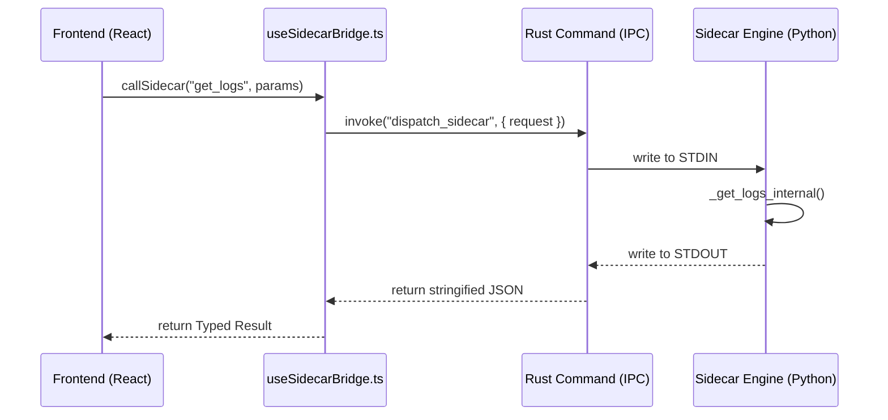

# Communication & Protocol (communication.md)

This document describes the bridging mechanism between the Tauri Rust layer and the Python sidecar engine, as well as the JSON-RPC 2.0 contract.

## 👤 Persona: `@bridge-arch`
Expert in distributed communication, JSON-RPC 2.0 specs, and low-latency bridging. Focuses on the "Tauri ↔ Sidecar" interface.

## 🌉 The Bridge (useSidecarBridge.ts)
LogLensAi uses a unified `callSidecar<T>` function to handle all communication with the sidecar.

| Path | Protocol | Purpose |
|---|---|---|
| **Development** | HTTP (Port 5000) | Local dev server for faster hot-reloading. |
| **Production** | STDIN / STDOUT | Direct pipe between the Tauri process and the Sidecar binary. |

### Error Propagation Flow
1. **Python Exception**: Caught in `api.py`. Returns a JSON-RPC error object with status `-32603` (Internal Error).
2. **Rust Wrapper**: Receives the response over the pipe.
3. **JS/TS Frontend**: `callSidecar` parses the error object and throws a detailed `Error` that includes Python tracebacks in dev mode.

## 📡 JSON-RPC 2.0 Specification

All requests must conform to the following schema:

```json
{
  "jsonrpc": "2.0",
  "id": 123,
  "method": "<method_name>",
  "params": {
    "workspace_id": "ws_001",
    "..." : "..."
  }
}
```

### Response (Success)
```json
{
  "jsonrpc": "2.0",
  "id": 123,
  "result": { "status": "ok" }
}
```

### Response (Error)
```json
{
  "jsonrpc": "2.0",
  "id": 123,
  "error": {
    "code": -32603,
    "message": "Internal error",
    "data": "Python Exception Traceback..."
  }
}
```

## 🔐 Type-Safety Guardrails

### Pydantic Validation (Backend)
Every incoming request in `api.py` is validated against a Pydantic `BaseModel`. This ensures that required fields (like `workspace_id`) are present before any logic begins.

### TypeScript Interfaces (Frontend)
Response data from `callSidecar<T>` should be cast to a global interface defined in the corresponding layer (e.g., `LogEntry[]` for `get_logs`).

## 🔄 Interaction Diagram (Request ↔ Response)


