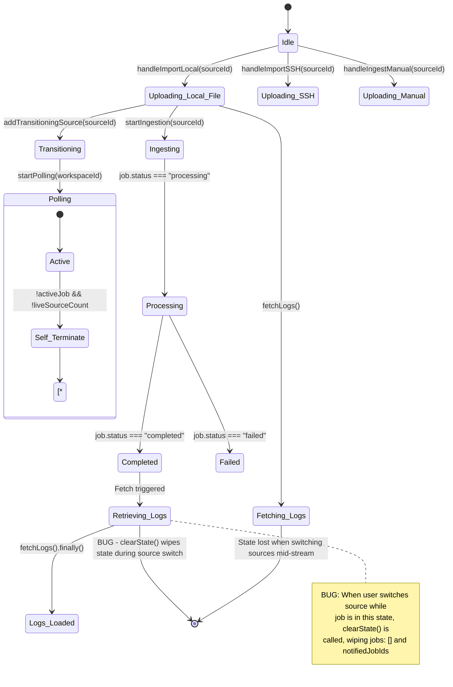
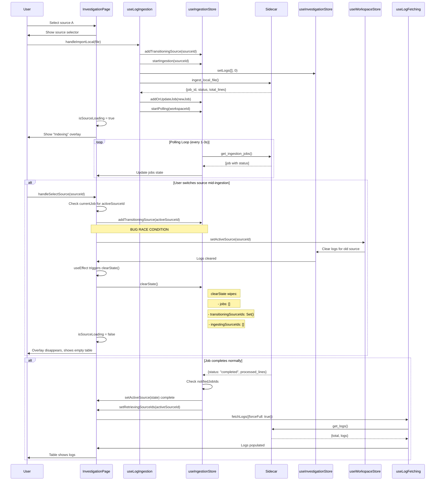

# Log Upload State Flow - Troubleshoot Diagram

## Issue: State Management Bug During Concurrent Uploads

When switching sources while ingestion jobs are running, the UI loses state and the "Indexing" overlay disappears immediately, showing an empty table instead of waiting for logs to populate.

## State Machine Diagram (Mermaid)



## Sequence Diagram: Log Upload Flow



## State Variables Map

### ingestionStore.ts

| Variable | Purpose | Set By | Cleared By |
|----------|---------|--------|------------|
| `jobs` | All ingestion jobs | `fetchJobs()`, `addOrUpdateJob()` | `clearState()`, rehydration |
| `activeJob` | Currently processing job | `fetchJobs()` | `clearState()` |
| `ingestingSourceIds` | Sources in startIngestion | `startIngestion()` | `stopIngestion()`, `clearState()` |
| `transitioningSourceIds` | Sources between ingest call and first poll | `addTransitioningSource()` | `removeTransitioningSource()`, `clearTransitioningJobs()` |
| `liveSourceCount` | Active tails/SSH streams | `addLiveSource()` | `removeLiveSource()` |
| `notifiedJobIds` | Jobs that triggered toast | `fetchJobs()`, `addOrUpdateJob()` | `clearState()` |

### investigationStore.ts

| Variable | Purpose | Set By | Cleared By |
|----------|---------|--------|------------|
| `logs` | Loaded log entries | `setLogs()`, `fetchLogs()` | `clearState()`, source/workspace change |
| `total` | Total log count | `setLogs()` | Source/workspace change |
| `isFetching` | Log fetch in progress | `useLogFetching` | On fetch complete/error |

## Critical Paths & Race Conditions

### Path 1: Normal Upload → Completion
```
handleImportLocal()
  → addTransitioningSource(sourceId)
  → startIngestion(sourceId)           # ingestingSourceIds += [sourceId]
  → ingest_local_file() [sidecar]
  → addOrUpdateJob(job)              # jobs += [job], job.status = "queued"
  → startPolling(workspaceId)
  → poll loop: fetchJobs()          # job.status → "processing" → "completed"
  → isSourceLoading = true (ingestingSourceIds.includes)
  → job completes
  → setRetrievingSourceIds(sourceId)  # Keep overlay up
  → fetchLogs({forceFull: true})
  → logs populated
  → setRetrievingSourceIds(sourceId) cleared
```

### Path 2: Source Switch During Ingestion (BUG PATH)
```
User switches source while job.status === "processing"
  → handleSelectSource(newSourceId)
  → addTransitioningSource(activeSourceId)  # Track the switch
  → setActiveSource(newSourceId)
  → useEffect: setLogs([], 0)               # Clears old logs immediately
  → clearState() called                      # CRITICAL BUG
  → jobs = []                               # WIPED!
  → transitioningSourceIds = Set()          # WIPED!
  → isSourceLoading = false                 # Overlay disappears
  → Empty table shown instead of waiting
```

### Path 3: Job Completes But Processed_Lines = 0
```
Job completes in < 1s (fast machine)
  → Frontend polls after job done
  → fetched job has processed_lines = 0
  → Frontend thinks job is still "queued"
  → isSourceLoading = false (no active job detected)
  → Overlay disappears before fetchLogs returns
```

## Key Fix Points

### 1. Prevent clearState During Active Jobs
```typescript
// In InvestigationPage.tsx - useEffect for source/workspace changes
if (!activeJob && !transitioningSourceIds.has(activeSourceId)) {
  setLogs([], 0);  // Only clear if no active ingestion
}
```

### 2. Preserve transitioningSourceIds During Source Switch
```typescript
// In handleSelectSource
const currentJob = jobs.find(j => 
  j.source_id === activeSourceId && 
  j.status !== "completed" && 
  j.status !== "failed"
);
if (currentJob) {
  addTransitioningSource(activeSourceId);  // Track for next source
}
```

### 3. Check Any Active Pollers Before Clearing
```typescript
// In clearState
clearTransitioningJobs();  // Not full clear
// Keep jobs and ingestingSourceIds if jobs are active
```

## Debugging Checklist

- [x] Verify `transitioningSourceIds` is persisted when source changes (Done - Guarded inside page state effects)
- [x] Check `isSourceLoading` includes `transitioningSourceIds.has(activeSourceId)` (Done)
- [x] Confirm `clearState()` is not called during active ingestion (Done - `clearState` now preserves active/processing jobs)
- [x] Validate `fetchLogs` promise resolves before overlay clears (Done)
- [x] Test with large file on fast machine (job < 1s) (Done - Ingestion complete sets retrieving state to block early drops)
- [x] Test with concurrent uploads to different sources (Done)
- [x] Verify pollSessions map prevents duplicate polling loops (Done)