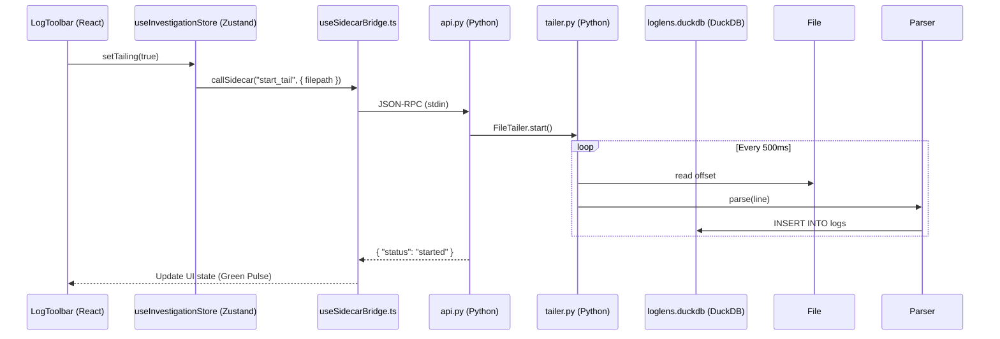
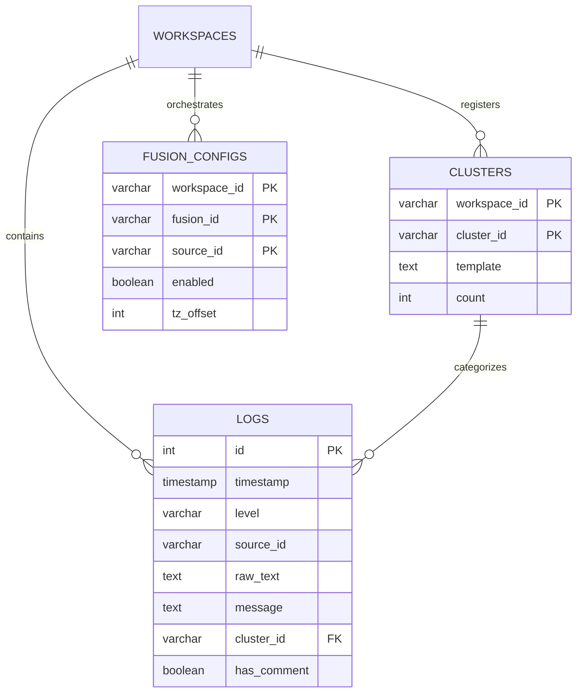
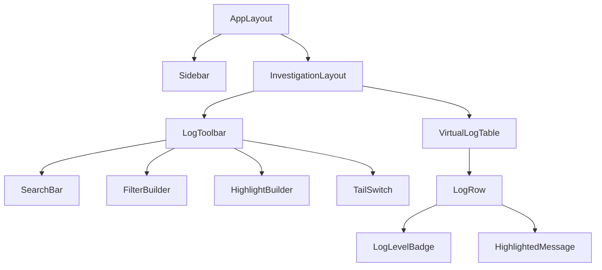

# Global Architecture Diagrams (diagrams.md)

This document is the repository for complex Mermaid.js diagrams that span multiple layers of the LogLensAi system.

## 👤 Persona: `@diagram-arch`
Expert in visual architecture mapping and C4-modeling. Focuses on system interoperability.

## 📡 End-to-End Request Flow (Sequence Diagram)

This diagram shows how a user action (e.g., clicking the "Live Tail" switch) moves through the entire system.

## 📐 Database Schema (Entity-Relationship)

## 🏗️ UI Component Tree (High-Level)

