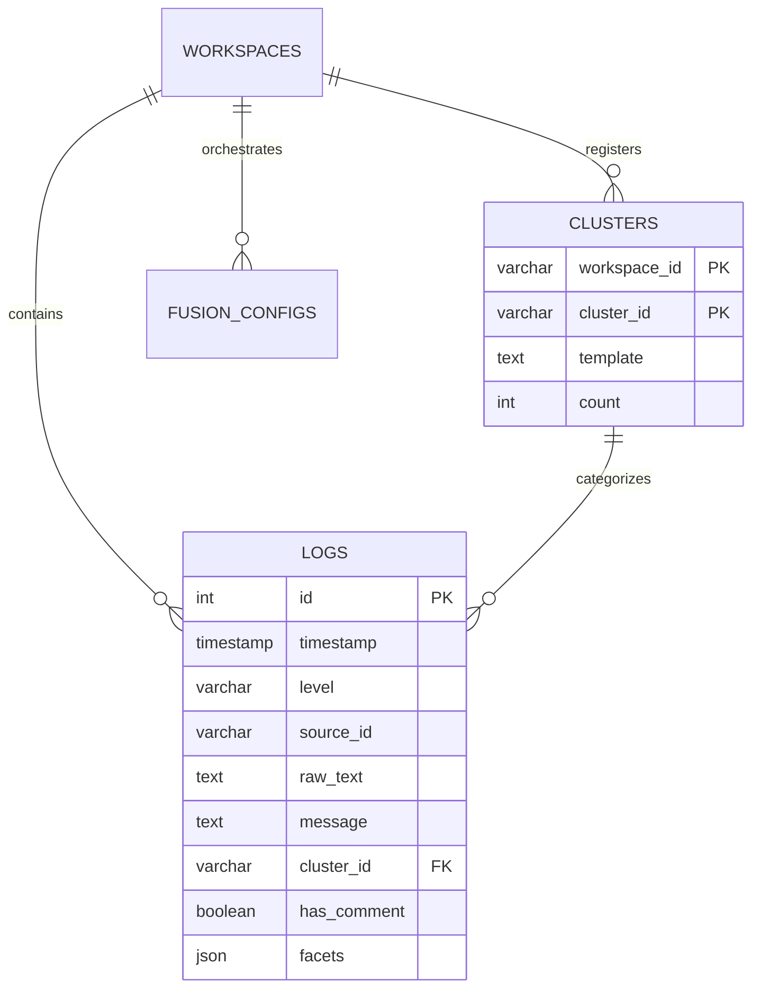

# Backend Architecture (layers/backend.md)

This document describes the Python sidecar engine, its internal modules, JSON-RPC API methods, and the DuckDB persistence layer.

## 👤 Persona: `@backend-arch`
Expert in high-performance log ingestion, statistical analysis, and DuckDB optimization. Focuses on the "Sidecar Engine" (Python 3.12).

## 🚀 Sidecar Engine Modules

| File | Module | Responsibility |
|---|---|---|
| `sidecar/src/api.py` | `dispatch` | JSON-RPC 2.0 router. Maps incoming calls to `method_*` handlers using Pydantic for validation. |
| `sidecar/src/db.py` | `Database` | DuckDB wrapper. Manages connection pooling (get_cursor) and schema migrations. |
| `sidecar/src/parser.py` | `DrainParser` | Drain3 log template clustering engine. Extracts variables from raw log strings. |
| `sidecar/src/tailer.py` | `FileTailer` | Background thread for real-time monitoring of local file system logs. |
| `sidecar/src/ssh_loader.py` | `SSHLoader` | Paramiko-based remote log streaming over SSH. |
| `sidecar/src/ai.py` | `AIProvider` | Integration with Gemini/OpenAI for log anomaly explanation and root-cause analysis. |

## 📡 JSON-RPC API Methods (api.py)

### Log Retrieval
- **`method_get_logs(workspace_id, offset, limit, filters, query, sort_by, sort_order, start_time, end_time)`**
  - Fetches paginated logs from DuckDB. Supports temporal filtering and cluster-aware sorting.
- **`method_get_fused_logs(workspace_id, fusion_id, ...)`**
  - Interleaves logs from multiple enabled sources based on the workspace's fusion configuration.
- **`method_get_log_distribution(workspace_id, fusion_id, source_ids, filters, query, start_time, end_time)`**
  - Aggregates logs into minutely buckets for visualization in the frontend distribution chart.

### Ingestion & Tailing
- **`method_ingest_logs(logs: list[IngestLogEntry])`**
  - High-speed batch insertion. Triggers Drain3 clustering for each log line.
- **`method_start_tail(filepath, workspace_id)`**
  - Spawns a `FileTailer` thread for real-time local monitoring.
- **`method_start_ssh_tail(host, port, username, password, filepath, workspace_id)`**
  - Spawns an `SSHLoader` thread for remote log streaming.
- **`method_stop_tail(filepath, workspace_id)`**
  - Gracefully shuts down tailing threads for a specific file or all files in a workspace.

### Intelligence & Configuration
- **`method_analyze_cluster(cluster_id, workspace_id)`**
  - Sends log samples from a cluster to the AI provider for explanatory analysis.
- **`method_get_anomalies(workspace_id, time_range)`**
  - Identifies statistical outliers and novel log patterns in real-time.
- **`method_export_logs(workspace_id, filepath, format, ...)`**
  - Exports matching logs (CSV/JSON) to a local file via native save dialog coordination.
- **`method_update_settings(settings: dict)`**
  - Persists AI provider keys and general app preferences to the `settings` table.

## 🗄️ Persistence Layer (DuckDB)

### Main Tables
- **`logs`**: Central log repository. 
  - `id` (INT), `timestamp` (TIMESTAMP), `level` (VARCHAR), `source_id` (VARCHAR), `raw_text` (TEXT), `message` (TEXT), `cluster_id` (VARCHAR), `comment` (TEXT), `has_comment` (BOOL), `workspace_id` (VARCHAR), `facets` (JSON).
- **`clusters`**: Drain3 template registry.
  - `workspace_id` (VARCHAR), `cluster_id` (VARCHAR), `template` (TEXT), `count` (INT).
- **`fusion_configs`**: Source orchestration settings.
  - `workspace_id`, `fusion_id`, `source_id`, `enabled`, `tz_offset`, `time_shift_seconds`.
- **`settings`**: Global persistent key-value store.

### 📐 Database ERD

## 🧠 Brain Evolution Log
- **2026-04-20**: Implemented `EXPORT-001` (CSV/JSON log export) and `metadata_faceting_001` (JSON facet extraction).
- **2026-03-29**: Integrated global temporal filtering across all `get_logs` and `get_log_distribution` methods.
- **2026-03-29**: Added `has_comment` flag to optimize virtual table rendering and filtering.
